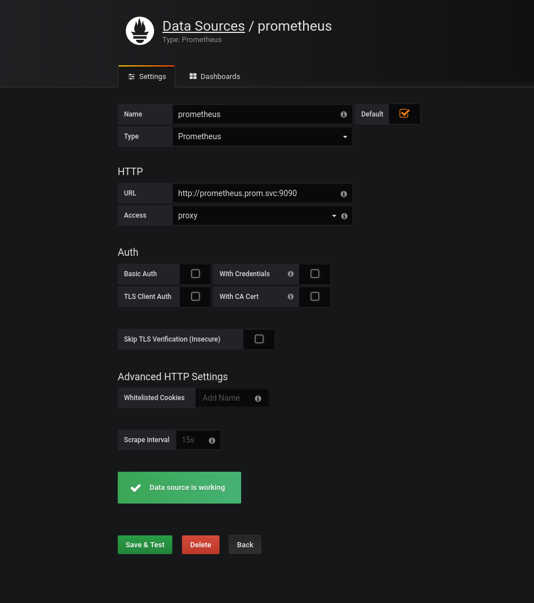

# k8s-prom

- prometheus目录：部署Promethues Metrics API Server所需要的各资源配置清单。
- k8s-prometheus-adapter目录：部署基于prometheus的自定义指标API服务器所需要的各资源配置清单。
- podinfo目录：测试使用的podinfo相关的deployment和service对象的资源配置清单。
- node_exporter目录：于kubernetes集群各节点部署node_exporter。
- kube-state-metrics：聚合kubernetes资源对象，提供指标数据。


#### 参考：https://github.com/stefanprodan/k8s-prom-hpa


### 部署prometheus
1. kubectl apply -f namespace.yaml
2. cd node_exporter/ && kubectl apply -f .
3. kubectl get pods -n prom
4. cd ../prometheus/ 
5. 删除 prometheus-deploy.yaml中的resources及其下面的值
```
        command:
          - prometheus
          - --config.file=/etc/prometheus/prometheus.yml
          - --storage.tsdb.path=/prometheus
          - --storage.tsdb.retention=720h
        ports:
        - containerPort: 9090
          protocol: TCP
        resources: #　删除
          limits:　＃　删除　
            memory: 2Gi # 删除
```
6. kubectl apply -f .
7. kubectl get all -n prom
8. 访问　http://11.11.11.112:30090/ 可以看到其中的界面

### 部署 kube-state-metrics
1.  cd ../kube-state-metrics/
2. 把 kube-state-metrics-deploy.yaml 中 gcr.io/google_containers/kube-state-metrics-amd64:v1.3.1 替换成 registry.cn-hangzhou.aliyuncs.com/hosea/kube-state-metrics-amd64:v1.3.1
3. kubectl apply -f .
4. kubectl get all -n prom 查看

### 部署 k8s-prometheus-adapter
1. 制作证书： cd /etc/kubernetes/pki/
2. (umask 077; openssl genrsa -out serving.key 2048)
3. openssl req -new -key serving.key -out serving.csr -subj "/CN=serving"
4. openssl x509 -req -in serving.csr -CA ./ca.crt -CAkey ./ca.key -CAcreateserial -out serving.crt -days 3650
5. kubectl create secret generic cm-adapter-serving-certs --from-file=serving.crt=./serving.crt --from-file=serving.key=./serving.key -n prom (这里起名的`cm-adapter-serving-certs`要和custom-metrics-apiserver-deployment.yaml 文件中 spec.template.volumes.secret.secretName 的名称要相同)
6. kubectl get secret -n prom 查看创建
7. cd metrics/k8s-prom/k8s-prometheus-adapter 中
8. kubectl apply -f .
9. kubectl get all -n prom 查看
10. kubectl api-versions 会出现custom.metrics.k8s.io/v1beta1

#### 部署 grafana
1. cd grafana
2. kubectl apply -f .
3. kubectl get all -n prom 查看 service 端口号， 浏览器进行访问
4. 按照图去配置 grafana, 然后去 grafana dashboard 下载合适json 文件， 然后导入



